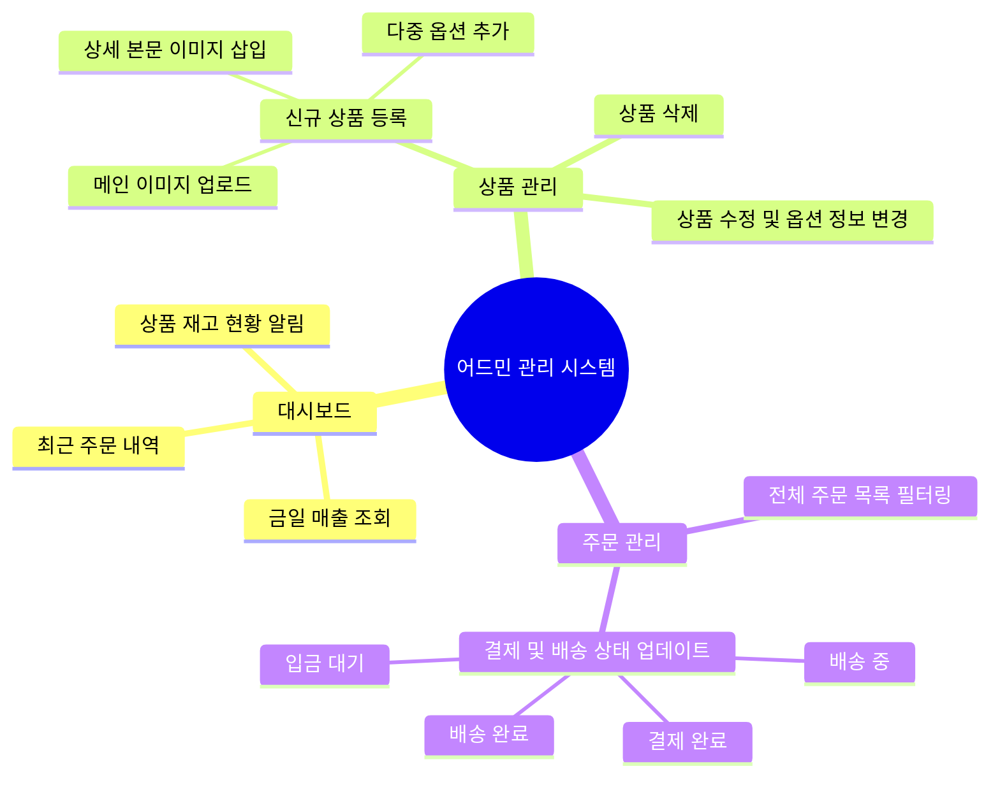

# 기능 명세서 (Functional Specification)

본 문서는 **비타민 쇼핑몰 (Vitamin Mall)** 프로젝트에서 제공하는 서비스 사용자 및 관리자 기능 범위와 주요 사용자 시나리오를 정의한 기능 명세서입니다.

---

## 1. 행위자(Actor) 정의
- **고객 (Customer)**: 비타민 몰 웹사이트에 접속하여 상품 정보를 탐색하고 상품을 장바구니에 담아 비회원/회원으로 주문을 진행하는 사용자.
- **관리자 (Administrator)**: 백오피스 어드민 사이트(`/admin`)에 접속하여 상품 정보를 등록/수정/삭제하고, 고객의 주문 현황을 파악하여 배송/주문 상태를 변경하는 주체.

---

## 2. 관리자 기능 정의 (어드민 백오피스)

### 2.1 대시보드 (`/admin`)
- 현재 쇼핑몰의 일별 주문 통계 및 결제 상태별 건수를 한눈에 확인합니다.
- 품절 직전인 상품의 잔여 재고 현황을 파악하여 빠른 발주 관리를 지원합니다.

### 2.2 상품 관리 (`/admin/products`)
- **상품 등록 및 편집**:
  - **상품 정보 입력**: 상품명, 설명, 기본 가격, 기본 재고를 등록합니다.
  - **이미지 업로드**: 상품의 대표 이미지 및 본문 추가 이미지를 마우스 드래그 앤 드롭 또는 파일 탐색기를 통해 업로드합니다. 업로드 즉시 Base64 형태로 메모리에 저장되어 대기하다가 최종 저장 시점에 PostgreSQL에 영구 반영됩니다.
  - **옵션 구조화**: 상품별 하위 옵션명(예: '용량', '포장형태') 및 상세 옵션값(예: '60정', '120정')을 입력하고, 해당 옵션 선택 시 추가되는 금액(`additionalPrice`) 및 옵션별 개별 재고(`stock`)를 개별 지정할 수 있습니다.
- **상품 삭제**: 상품 정보 삭제 시 연결된 모든 하위 옵션 구조 역시 데이터베이스에서 연쇄 삭제(Cascade Delete) 처리되어 관리 효율을 극대화합니다.

### 2.3 주문 관리 (`/admin/orders`)
- 쇼핑몰 전반에서 발생하는 모든 결제 및 주문 정보를 일자별, 상태별로 조회합니다.
- 고객의 결제 완료 여부를 확인한 후, 배송 중, 배송 완료 등의 상태 조절 기능을 제공합니다.

---

## 3. 고객 기능 정의 (쇼핑몰 프론트엔드)

### 3.1 상품 쇼핑 및 상세 페이지
- **상품 카드 렌더링**: 메인 화면에서 상품 대표 이미지와 이름, 가격, 옵션 보유 여부를 확인합니다.
- **상세 사양 확인**: 상품 설명 본문과 상세 이미지들을 보며 상품을 탐색합니다.
- **동적 옵션 선택**: 사용자는 필수 옵션들을 선택할 수 있으며, 추가금이 붙는 옵션 선택 시 최종 주문 합산 금액이 실시간으로 동적 변동되어 즉각적인 피드백을 제공합니다.

### 3.2 장바구니 및 체크아웃
- **장바구니 상태 관리**: 로컬 스토리지 또는 세션 브릿지를 기반으로 사용자가 선택한 옵션별 상품 라인업을 장바구니에 적재하고 수량을 유연하게 증감합니다.
- **비회원 결제 및 배송지 작성**: 
  - 로그인 없이도 이름, 연락처, 배송지 주소를 상세히 입력하여 구매 절차를 수행할 수 있습니다.
  - 비회원 주문 전용 비밀번호를 설정함으로써 향후 비회원 주문 추적이 가능하도록 지원합니다.

---

## 4. 핵심 사용자 시나리오 (User Scenario)

### 4.1 시나리오: 관리자의 상품 등록 및 이미지 PostgreSQL 영구 보관 과정
1. **관리자 어드민 페이지 접근**: 관리자가 `/admin/products` 메뉴를 열고 [상품 추가] 버튼을 탭합니다.
2. **이미지 파일 선택**: 로컬 컴퓨터의 PNG 영양제 사진을 업로드 필드에 드래그합니다.
3. **Base64 응답 수신**: 업로드 API는 서버 디스크를 소모하지 않고 `data:image/png;base64,...` 포맷 문자열을 클라이언트로 되돌려주어, 브라우저 화면 상에 미리보기를 제공합니다.
4. **저장 요청**: 관리자가 추가 금액(+5,000원)이 책정된 '180정 종합 선물세트' 옵션을 포함해 최종 [저장] 버튼을 클릭합니다.
5. **DB 트랜잭션 수행**: 
   - Prisma 리포지토리는 Base64 이미지 텍스트 데이터를 받아 원시 버퍼로 변환하여 PostgreSQL `imageBytes` 필드에 기록합니다.
   - 동시에 이 이미지 리소스의 고유 웹 액세스 링크 주소를 `/api/products/image/[new-product-uuid]` 형태로 변환해 `imageUrl` 필드에 보존합니다.
6. **동작 확인 완료**: 상품이 등록된 직후, 쇼핑몰 첫 화면에 접속하면 해당 영양제 사진이 DB로부터 동적 인출되어 엑박 없이 정상 표출됩니다.
