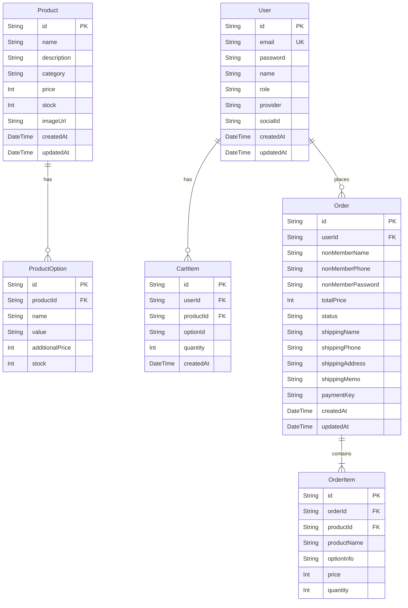
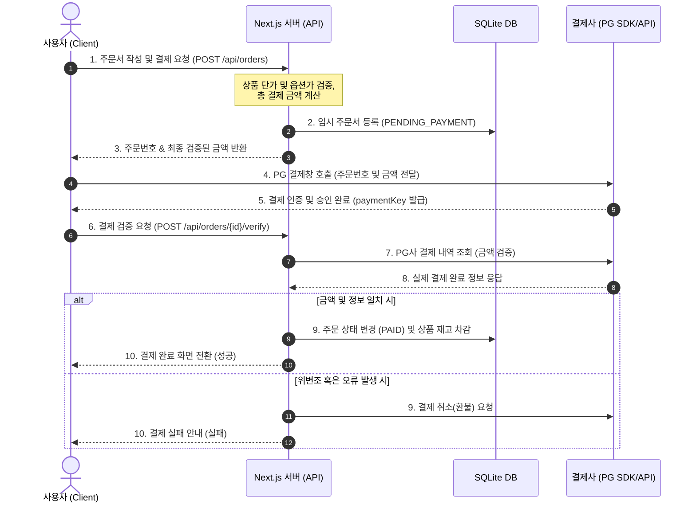

# 비타민 쇼핑몰 종합 프로그램 사양서 (Program Specification)

본 문서는 **Next.js**와 **SQLite(Prisma)**를 기반으로 설계 및 구축된 **비타민 쇼핑몰 (Vitamin Mall)** 프로젝트의 종합 사양서입니다. 기존의 기능, 기술, 디자인 명세 및 도메인 격리 배포 테스트 가이드를 단일 문서로 통합하여 개발 및 유지보수의 참조 편의성을 극대화합니다.

---

## 1. 프로젝트 개요 및 비즈니스 모델

### 1.1 개요
* **프로젝트명**: 비타민 쇼핑몰 (Vitamin Mall) - 감성 키링 및 패션 악세사리 전문 스토어
* **개발 목적**: 추가적인 클라우드 인프라 비용(예: AWS S3, Vercel Blob 등)을 완전히 배제하고, 독자 배포를 위해 Next.js 웹 서버와 가벼운 파일 기반 데이터베이스(SQLite)를 활용하여 최상의 비용 효율을 달성하는 견고한 커머스 웹 애플리케이션 구축.
* **주요 특징**:
  - 브랜드/상호명은 '비타민(VITAMIN)'을 사용하나, 실제 취급 및 판매하는 주력 상품군은 아기자기한 감성의 핸드메이드 키링, 패션 악세사리, 팬시 소품류입니다. (안공사 감성 디자인 벤치마킹 반영).
  - Next.js App Router 기반의 고성능 SSR(Server-Side Rendering) 및 Dynamic API Serving 구현.
  - 별도의 외부 스토리지 없이 로컬 디렉토리(`public/uploads`)에 상품 미디어 리소스를 관리하여 서버리스의 휘발성 파일 시스템 한계를 독자 배포 형태로 해결.

### 1.2 주요 비즈니스 모델
* **판매 상품**: 실물 배송 상품 (아기자기한 핸드메이드 비즈/아크릴 키링, 폰스트랩, 팔찌, 목걸이 등 패션 악세사리 소품군 일체)
* **회원 및 주문 정책**:
  - 회원 및 비회원 주문 모두 허용.
  - 일반 이메일 가입 및 소셜 로그인(Kakao, Naver, Google)을 지원하는 통합 회원 체계.
  - 비회원은 주문 후 발급된 주문번호와 비밀번호를 통해 주문 내역 및 배송 타임라인 조회 가능.
* **결제 정책**:
  - PG사 결제창 연동 인터페이스 설계 (초기 개발에서는 Mock 가상 결제 모듈을 사용하며, 추후 실 결제 모듈로 교체 가능한 구조 보장).
* **디바이스 대응**: PC와 모바일 디바이스에 모두 최적화된 반응형 웹 디자인 적용.

---

## 2. 시스템 아키텍처 및 폴더 구조

### 2.1 시스템 아키텍처 (2계층)
본 프로젝트는 **Next.js Web Server**와 **SQLite Database**로 구성된 심플하면서도 견고한 2계층 아키텍처로 최적화되어 있습니다.

```mermaid
graph TD
    Client[클라이언트 브라우저] <-->|HTTPS| Vercel[Next.js Web Server]
    Vercel <-->|Prisma ORM| DB[(SQLite Database)]
    
    subgraph Web Server Logic
        API_Upload[/api/admin/upload]
        StaticServing[/uploads/image_file]
        PrismaRepo[PrismaProductRepository]
    end

    Vercel -.-> API_Upload
    Vercel -.-> StaticServing
    Vercel -.-> PrismaRepo
```

### 2.2 폴더 구조 및 클린 아키텍처
Next.js App Router 프레임워크와 비즈니스 핵심 로직의 결합도(Coupling)를 낮추어 유지보수성과 테스트 용이성을 확보하기 위해 아래와 같이 계층이 분리된 구조를 적용합니다.

```text
/src
  /core                   # [Domain & Business Logic] 프레임워크 비의존적 핵심 로직
    /domains              # 상품, 옵션, 주문, 장바구니 등 핵심 데이터 구조 및 유효성 검증
    /services             # 주문 생성, 가격 계산, 배송 상태 전환 등의 실질적 서비스 비즈니스 구현
    /repositories         # 데이터 저장소에 접근하기 위한 인터페이스 (Prisma 등 외부 구현체와 디커플링)
    
  /infrastructure         # [Infrastructure] 외부 시스템 및 프레임워크 구현체 연동
    /database             # Prisma Client 구현체 및 리포지토리 구체화 (SQLite)
    /payments             # 결제 연동 인터페이스 구현 (초기 Mock 가상 결제 모듈 장착)
    /auth                 # NextAuth 등 소셜 로그인/인증 구현체
    
  /app                    # [Delivery Mechanism] Next.js App Router (UI 및 API 라우트)
    /api                  # HTTP API 엔드포인트 (Core Service를 호출하여 JSON 응답 반환)
    /admin                # 관리자 웹 페이지 (상품 등록, 주문 관리, 배송 상태 수정 등)
    /products             # 일반 상품 목록 및 상세 보기 화면
    /cart                 # 장바구니 관리 화면
    /orders               # 주문서 작성 및 결제 진행 화면
    /(auth)               # 로그인, 회원가입 화면
    
  /components             # 공통 UI 컴포넌트 (버튼, 모달, 입력 필드 등)
  /styles                 # Vanilla CSS 기반 테마, 변수, 공통 레이아웃 스타일 파일
```

---

## 3. 기술 스택 (Technology Stack)

* **Core Framework**: Next.js (v14.2.3, App Router 채택)
* **UI Library**: React (v18.x) & TypeScript (v5.x)
* **Database & ORM**: SQLite & Prisma Client / Prisma ORM (v5.22.0)
* **Infrastructure**: Node.js (v20.19.0 이상 또는 v22.12.0 이상 권장 - rolldown 빌더 호환 목적)
* **Styling**: Vanilla CSS (CSS Variables 기반 일관된 디자인 토큰 활용)
* **Test Tool**: Vitest (단위 테스트 자동화)

---

## 4. 데이터베이스 스키마 설계 (SQLite with Prisma)

데이터베이스 설계는 `Prisma ORM`을 바탕으로 작성되었으며, 로컬 루트 경로의 `dev.db` 파일에 매핑되어 작동합니다.

### 4.1 ERD 다이어그램



### 4.2 물리 스키마 정의 (schema.prisma)

```prisma
// 1. 회원 정보 (일반 회원 및 소셜 회원 통합)
model User {
  id           String    @id @default(uuid())
  email        String?   @unique                    // 일반 가입용 (소셜은 null 가능)
  password     String?                              // 비밀번호 해시 (소셜은 null)
  name         String
  role         Role      @default(USER)             // USER, ADMIN
  provider     String    @default("LOCAL")          // LOCAL, KAKAO, NAVER, GOOGLE
  socialId     String?                              // 소셜 로그인 고유 식별값
  createdAt    DateTime  @default(now())
  updatedAt    DateTime  @updatedAt
  orders       Order[]
  carts        CartItem[]
}

enum Role {
  USER
  ADMIN
}

// 2. 상품 정보
model Product {
  id           String    @id @default(uuid())
  name         String
  description  String
  category     String    @default("아크릴 키링")     // 상품 카테고리 속성 추가
  price        Int                                  // 기본 가격
  stock        Int       @default(0)                // 기본 재고
  imageUrl     String?                              // 저장된 파일의 상대 경로 (/uploads/파일명)
  createdAt    DateTime  @default(now())
  updatedAt    DateTime  @updatedAt
  options      ProductOption[]
}

// 3. 상품 옵션 (예: 색상, 사이즈 등)
model ProductOption {
  id              String   @id @default(uuid())
  productId       String
  product         Product  @relation(fields: [productId], references: [id], onDelete: Cascade)
  name            String                            // 옵션 종류 (예: "색상", "사이즈")
  value           String                            // 옵션 값 (예: "Black", "XL")
  additionalPrice Int      @default(0)              // 선택 시 가산 금액
  stock           Int      @default(0)              // 옵션별 개별 재고
}

// 4. 장바구니
model CartItem {
  id              String         @id @default(uuid())
  userId          String
  user            User           @relation(fields: [userId], references: [id], onDelete: Cascade)
  productId       String
  optionId        String?                           // 선택한 옵션 ID (Optional)
  quantity        Int            @default(1)
  createdAt       DateTime       @default(now())
}

// 5. 주문 마스터 (회원 / 비회원 통합)
model Order {
  id                 String      @id                 // 주문번호 (예: 20260622-XXXXX)
  userId             String?                         // 회원 ID (비회원은 null)
  user               User?       @relation(fields: [userId], references: [id], onDelete: SetNull)
  
  // 비회원 정보 (userId가 null일 때 필수 기입)
  nonMemberName      String?
  nonMemberPhone     String?
  nonMemberPassword  String?                         // 비회원 주문조회용 해시 비밀번호
  
  totalPrice         Int                             // 총 결제 금액
  status             OrderStatus @default(PENDING_PAYMENT)
  
  // 배송지 정보
  shippingName       String
  shippingPhone      String
  shippingAddress    String
  shippingMemo       String?
  
  // 결제 정보
  paymentKey         String?                         // 결제 거래 ID
  createdAt          DateTime    @default(now())
  updatedAt          DateTime    @updatedAt
  items              OrderItem[]
}

enum OrderStatus {
  PENDING_PAYMENT // 결제 대기
  PAID            // 결제 완료
  PREPARING       // 배송 준비중
  SHIPPING        // 배송중
  DELIVERED       // 배송 완료
  CANCELLED       // 주문 취소
}

// 6. 주문 상세 항목 (주문 시점의 데이터 스냅샷 저장)
model OrderItem {
  id          String   @id @default(uuid())
  orderId     String
  order       Order    @relation(fields: [orderId], references: [id], onDelete: Cascade)
  productId   String
  productName String                               // 주문 시점 상품명 복사
  optionInfo  String?                              // 주문 시점 선택 옵션 정보 요약 복사 (예: "색상: Black / 사이즈: L (+1,000원)")
  price       Int                                  // 주문 시점 단가 복사
  quantity    Int
}
```

---

## 5. 이미지 파일 업로드 및 서빙 아키텍처

로컬 파일 디스크 자원을 최적화하고, 어드민 화면에서 편리하게 이미지를 올릴 수 있도록 구현된 메커니즘입니다. (기존에 고안되었던 DB 직접 저장 방식에서, 로컬 개발 및 테스트 성능 복구를 위해 **로컬 디렉토리 물리 저장** 방식으로 연동을 수립했습니다.)

### 5.1 파일 업로드 API 스펙 (`POST /api/admin/upload`)
* **역할**: 클라이언트에서 넘어온 폼 데이터(이미지 파일)를 추출하여 고유 파일명을 부여하고 로컬 파일 시스템에 저장합니다.
* **물리 저장소**: 프로젝트 루트 경로의 `public/uploads` 디렉토리 (없을 경우 런타임에 자동 재귀 생성)
* **파일명 식별 규칙**: `${Date.now()}-${Math.round(Math.random() * 1e9)}-${original_filename}`
* **클라이언트 반환 포맷 (200 OK)**:
  ```json
  {
    "url": "/uploads/1782200632457-841933748-prod_image.png"
  }
  ```

### 5.2 UI/UX 이미지 업로드 인터페이스
* **대표 이미지 업로드**: "📁 대표 이미지 선택" 버튼을 클릭하여 선택 완료 시 `func_HandleMainImageUpload`를 통해 업로드된 상대 경로를 `imageUrl` 상태에 저장하고 미리보기 썸네일을 표시합니다.
* **본문 중간 이미지 추가**: 상품 설명 입력창(`textarea`) 하단의 버튼을 통해 업로드 후, 현재 텍스트 캐럿(커서) 위치를 찾아 자동으로 반응형 `` 마크업 HTML 코드를 실시간 삽입합니다.
* **상세 컷 이미지 업로드**: 하단 전용 상세 이미지를 별도로 업로드하여, 폼 제출 시(`func_OnSubmit`) 개행 문자를 `<br />`로 가공한 설명 텍스트 본문과 하단 `` 태그를 하나의 HTML 템플릿 스트레치 블록(`div.product-detail`)으로 병합하여 `description` 필드에 일괄 저장합니다.

---

## 6. 결제 검증 흐름 및 핵심 API 명세

### 6.1 안전한 2단계 결제 프로세스
금액 위변조(클라이언트 측 가격 변조)를 원천 차단하기 위해, 브라우저 단독 결제 승인이 아닌 **백엔드 서버 2차 검증** 구조를 활용합니다.



### 6.2 핵심 API 스펙 요약

#### [사용자용 API]
* `GET /api/products` : 상품 목록 조회 (검색, 정렬 지원)
* `GET /api/products/[id]` : 상품 상세 및 옵션 목록 정보 조회
* `POST /api/orders` : 임시 주문서 생성 및 서버 검증 금액 산출
* `POST /api/orders/[id]/verify` : 결제 인증 키 최종 대조 및 주문 확정
* `POST /api/orders/track` : 비회원 주문자명/연락처 입력을 통한 주문 조회 토큰 매칭
* `GET /api/orders/[id]` : 특정 주문 상세 조회 (권한 가드 작동)

#### [관리자용 API]
* `POST /api/admin/products` : 신규 상품 등록 (동적 옵션 추가 구조 포함)
* `PUT /api/admin/products/[id]` : 상품 정보 및 관련 옵션 수정
* `DELETE /api/admin/products/[id]` : 상품 제거 (Cascade 옵션을 통해 하위 옵션 동시 삭제)
* `GET /api/admin/orders` : 전체 주문 목록 조회
* `PATCH /api/admin/orders/[id]/status` : 주문 상태(배송 처리 등) 변경

---

## 7. 도메인 격리 및 보안 라우팅 가드 (Domain Isolation)

일반 사용자 도메인과 어드민용 전용 도메인을 분리하여 일반 사용자의 불필요한 관리자 자원 무단 접근을 원천 봉쇄합니다.

### 7.1 도메인 매핑
* **일반 사용자 도메인 (`CLIENT_HOST`)**: 예: `localhost:3000` / `shop.com`
* **관리자 전용 도메인 (`ADMIN_HOST`)**: 예: `admin.localhost:3000` / `admin.shop.com`

### 7.2 Next.js 미들웨어 라우팅 차단 로직 (Middleware Guard)
1. 사용자가 일반 사용자 도메인(`CLIENT_HOST`)을 통해 접속합니다.
2. 미들웨어는 들어오는 요청의 URL이 `/admin` 또는 `/api/admin` 하위 경로에 부합하는지 판별합니다.
3. 대상 경로 진입 시도 시, 로그인 토큰 유무에 상관없이 즉시 **`404 Not Found`** 응답을 반환하여 리소스의 물리적 실존 자체를 은폐하고 철저히 격리합니다.
4. 네비게이션 헤더 등 공통 레이아웃 컴포넌트 내에서도 일반 클라이언트 접속 시에는 '관리자' 이동 링크를 렌더링하지 않습니다.

---

## 8. UI/UX 화면 구성 (PC/모바일 반응형)

### 8.1 일반 사용자 서비스 화면
1. **메인 페이지 (Home)**: 최상단 글로벌 네비게이션(장바구니 실시간 배지), 히어로 프로모션 스와이프 배너, 상품 그리드 리스트(PC 4열, 모바일 2열 자동 레이아웃 변환).
2. **상품 상세 페이지 (Product Details)**: 상품 이미지 슬라이더, 동적 옵션 드롭다운(추가 가격 실시간 누적 합산), 모바일 플로팅 하단 구매/장바구니(SVG 아이콘화 및 바로구매 플렉스 가로정렬) 탑재.
3. **장바구니 페이지 (Cart)**: 로컬 스토리지(`cart_items`)를 활용하여 비회원도 장바구니 유지가 가능하며, 수량 조절, 실시간 합계, 선택 품목/일괄 주문(체크박스) 기능을 수행합니다.
4. **주문서 작성 페이지 (Checkout)**: 배송지 작성 폼, **'주문자와 동일'** 동기화 체크 기능 및 PG 가상 결제창 연동.
5. **주문 완료 화면 (Order Success)**: 오배송을 방지하기 위해 사용자가 입력한 배송 주소와 수령인 연락처 정보를 두드러지게 표현하는 **2차 정보 재확인 요약 카드**를 제공합니다.
6. **주문 내역 조회 화면 (Order History)**: 회원은 즉시 주문 목록을 조회하고, 비회원은 이름/연락처 입력을 통해 인증을 진행합니다. 주문 상세 목록은 **아코디언 토글**로 제공하여 슬라이딩 방식으로 열고 닫을 수 있습니다.

### 8.2 관리자 전용 화면 (Admin Desk)
* **대시보드 (Dashboard)**: 금일 매출 요약 카드, 실시간 주문 접수 내역, 품절 직전 재고 알림판 제공.
* **상품 등록/관리 (Product Management)**: 테이블 형식의 전체 상품 목록, 드래그 앤 드롭 파일 업로드를 지원하는 상품 추가/수정 폼(옵션 추가 버튼을 클릭해 무한에 가까운 유동적 옵션 관리 지원).
* **주문 및 배송 관리 (Order Management)**: 결제 대기부터 배송 완료까지의 주문 상태별 필터링 검색 기능 및 원클릭 배송 처리 송장 입력 폼 제공.
