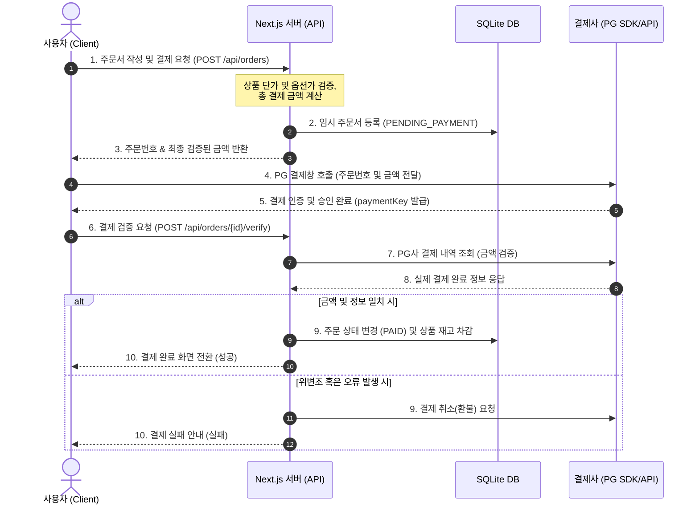

# 쇼핑몰 웹사이트 구축 사양서 (Design Specification)

본 문서는 반응형 쇼핑몰 웹사이트 구축을 위한 기능 요구사항 및 시스템 설계 사양을 정의합니다. 본 프로젝트는 개인용 Windows 노트북 호스팅 환경에 최적화하여 설계되었습니다.

---

## 1. 개요 및 기능 요구사항

### 1.1. 주요 비즈니스 모델
* **판매 상품**: 실물 배송 상품 (예: 의류, 잡화 등 배송지 정보가 필요한 실물)
* **회원 및 주문 정책**:
  * 회원/비회원 주문 모두 허용.
  * 일반 이메일 가입 및 소셜 로그인(Kakao, Naver, Google)을 지원하는 통합 회원 체계.
  * 비회원은 주문 후 주문번호와 임시 비밀번호를 통해 주문 내역 조회 가능.
* **결제 정책**: 
  * PG사 결제창 연동 필수 (초기 개발 단계에서는 인터페이스 설계를 바탕으로 Mock 가상 결제 모듈 사용, 추후 실 결제 모듈 교체 가능 구조).
* **디바이스 대응**: PC와 모바일 디바이스에 모두 최적화된 반응형 웹 디자인 적용.

### 1.2. 시스템 제약 사항 및 호스팅
* **호스팅 환경**: Windows 기반 개인용 노트북.
* **네트워크**: 단일 포트(예: `3000`) 노출을 통한 포트 설정 및 방화벽 관리 최소화.
* **리소스 관리**: 무거운 데이터베이스 엔진(MySQL 등)의 별도 설치를 피하고, 로컬 디스크 파일 기반 데이터베이스(SQLite)를 활용하여 시스템 가벼움 및 관리 용이성 극대화.

---

## 2. 아키텍처 및 폴더 구조

Next.js App Router 프레임워크와 비즈니스 핵심 로직의 결합도(Coupling)를 낮추어 유지보수성과 테스트 용이성을 확보하는 클린 아키텍처 구조를 적용합니다.

```text
/src
  /core                   # [Domain & Business Logic] 프레임워크 비의존적 핵심 로직
    /domains              # 상품, 주문, 장바구니 등 핵심 데이터 구조 및 유효성 검증
    /services             # 주문 생성, 가격 계산, 배송 상태 전환 등의 실질적 기능 구현
    /repositories         # 데이터 저장소에 접근하기 위한 인터페이스 (Prisma와 디커플링)
    
  /infrastructure         # [Infrastructure] 외부 시스템 및 프레임워크 구현체 연동
    /database             # Prisma Client 구현체 및 리포지토리 구체화 (SQLite)
    /payments             # 결제 연동 인터페이스 구현 (초기에는 Mock가상결제 모듈 장착)
    /auth                 # NextAuth 등 소셜 로그인/인증 구현체
    
  /app                    # [Delivery Mechanism] Next.js App Router (UI 및 API 라우트)
    /api                  # HTTP API 엔드포인트 (Core Service를 호출하여 JSON 응답 반환)
    /admin                # 관리자 웹 페이지 (상품 등록, 주문 관리, 배송 상태 수정 등)
    /products             # 일반 상품 목록 및 상세 보기 화면
    /cart                 # 장바구니 관리 화면
    /orders               # 주문서 작성 및 결제 진행 화면
    /(auth)               # 로그인, 회원가입 화면
    
  /components             # 공통 UI 컴포넌트 (버튼, 모달, 입력 필드 등)
  /styles                 # Vanilla CSS 기반 테마, 변수, 공통 레이아웃 스타일 파일
```

---

## 3. 데이터베이스 스키마 설계 (SQLite with Prisma)

```prisma
// 1. 회원 정보 (일반 회원 및 소셜 회원 통합)
model User {
  id           String    @id @default(uuid())
  email        String?   @unique                    // 일반 가입용 (소셜은 null 가능)
  password     String?                              // 비밀번호 해시 (소셜은 null)
  name         String
  role         Role      @default(USER)             // USER, ADMIN
  provider     String    @default("LOCAL")          // LOCAL, KAKAO, NAVER, GOOGLE
  socialId     String?                              // 소셜 로그인 고유 식별값
  createdAt    DateTime  @default(now())
  updatedAt    DateTime  @updatedAt
  orders       Order[]
  carts        CartItem[]
}

enum Role {
  USER
  ADMIN
}

// 2. 상품 정보
model Product {
  id           String    @id @default(uuid())
  name         String
  description  String
  price        Int                                  // 기본 가격
  stock        Int       @default(0)                // 기본 재고
  imageUrl     String?                              // 대표 이미지
  createdAt    DateTime  @default(now())
  updatedAt    DateTime  @updatedAt
  options      ProductOption[]
}

// 3. 상품 옵션 (예: 색상, 사이즈 등)
model ProductOption {
  id              String   @id @default(uuid())
  productId       String
  product         Product  @relation(fields: [productId], references: [id], onDelete: Cascade)
  name            String                            // 옵션 종류 (예: "색상", "사이즈")
  value           String                            // 옵션 값 (예: "Black", "XL")
  additionalPrice Int      @default(0)              // 선택 시 가산 금액
  stock           Int      @default(0)              // 옵션별 개별 재고
}

// 4. 장바구니 (회원은 DB에 저장, 비회원은 클라이언트 로컬스토리지에서 처리)
model CartItem {
  id              String         @id @default(uuid())
  userId          String
  user            User           @relation(fields: [userId], references: [id], onDelete: Cascade)
  productId       String
  optionId        String?                           // 선택한 옵션 ID (Optional)
  quantity        Int            @default(1)
  createdAt       DateTime       @default(now())
}

// 5. 주문 마스터 (회원 / 비회원 통합)
model Order {
  id                 String      @id                 // 주문번호 (예: 20260622-XXXXX)
  userId             String?                         // 회원 ID (비회원은 null)
  user               User?       @relation(fields: [userId], references: [id], onDelete: SetNull)
  
  // 비회원 정보 (userId가 null일 때 필수 기입)
  nonMemberName      String?
  nonMemberPhone     String?
  nonMemberPassword  String?                         // 비회원 주문조회용 해시 비밀번호
  
  totalPrice         Int                             // 총 결제 금액
  status             OrderStatus @default(PENDING_PAYMENT)
  
  // 배송지 정보
  shippingName       String
  shippingPhone      String
  shippingAddress    String
  shippingMemo       String?
  
  // 결제 정보 (추후 결제 연동 시 사용)
  paymentKey         String?                         // 결제 거래 ID
  createdAt          DateTime    @default(now())
  updatedAt          DateTime    @updatedAt
  items              OrderItem[]
}

enum OrderStatus {
  PENDING_PAYMENT // 결제 대기
  PAID            // 결제 완료
  PREPARING       // 배송 준비중
  SHIPPING        // 배송중
  DELIVERED       // 배송 완료
  CANCELLED       // 주문 취소
}

// 6. 주문 상세 항목 (주문 시점의 데이터 스냅샷 저장)
model OrderItem {
  id          String   @id @default(uuid())
  orderId     String
  order       Order    @relation(fields: [orderId], references: [id], onDelete: Cascade)
  productId   String
  productName String                               // 주문 시점 상품명 복사
  optionInfo  String?                              // 주문 시점 선택 옵션 정보 요약 복사 (예: "색상: Black / 사이즈: L (+1,000원)")
  price       Int                                  // 주문 시점 단가 복사
  quantity    Int
}
```

---

## 4. 핵심 API 설계 및 결제 데이터 흐름

### 4.1. API 스펙 요약

#### [사용자용 API]
* `GET /api/products` : 상품 목록 조회 (필터링, 검색, 페이징 지원)
* `GET /api/products/[id]` : 상품 상세 및 옵션 정보 조회
* `POST /api/orders` : 임시 주문서 생성 (금액 위변조 검증용)
* `POST /api/orders/[id]/verify` : 결제 완료 후 결제 데이터 최종 검증 및 주문 확정
* `POST /api/orders/[id]/query` : 비회원 주문 내역 조회용 비밀키 매칭 API
* `GET /api/orders/[id]` : 특정 주문 상세 내역 조회 (권한 검증 포함)

#### [관리자용 API]
* `POST /api/admin/products` : 신규 상품 등록 (옵션 구조 포함)
* `PUT /api/admin/products/[id]` : 상품 정보 및 옵션 수정
* `DELETE /api/admin/products/[id]` : 상품 삭제
* `GET /api/admin/orders` : 전체 주문 내역 목록 조회
* `PATCH /api/admin/orders/[id]/status` : 주문 상태 변경 (예: 배송 시작, 배송 완료 등)

### 4.2. 안전한 결제 검증 흐름

클라이언트 브라우저 상의 임의 데이터 조작(가격 위변조)을 방지하기 위해 다음과 같은 2단계 결제 프로세스를 준수합니다.



---

## 5. UI/UX 화면 구성 (PC/모바일 반응형 사양)

모바일 터치 인터페이스와 PC의 넓은 그리드 화면에 유연하게 대응하는 반응형 화면을 설계합니다.

### 5.1. 일반 사용자 화면
1. **메인 페이지 (Home)**
   - 최상단: 반응형 글로벌 네비게이션 바 (로그인 상태, 장바구니 카운트, 모바일 햄버거 메뉴 포함)
   - 히어로 영역: 프로모션 및 최신 상품 슬라이드 배너 (터치 스와이프 지원)
   - 바디 영역: 판매 중인 상품 목록 (PC: 4열 그리드, 태블릿: 3열, 모바일: 2열 그리드로 레이아웃 자동 전환)
2. **상품 상세 페이지 (Product Details)**
   - 좌측(모바일은 최상단): 상품 이미지 슬라이더
   - 우측(모바일은 하단): 상품명, 가격, 설명 및 옵션 선택 드롭다운 (옵션 변경 시 추가 금액 실시간 합산 표시)
   - 하단 고정 바: 모바일 환경에서 화면 스크롤 시에도 항상 노출되는 '바로 구매' 및 '장바구니' 플로팅 버튼 바 적용
3. **장바구니 페이지 (Cart)**
   - 상품별 수량 증감 버튼, 체크박스를 통한 개별/전체 선택 및 삭제 기능
   - 우측 배너(모바일은 최하단): 상품 가격 합계, 배송비 계산, 예상 최종 결제 금액이 반영되는 실시간 견적창
4. **주문/결제 작성 페이지 (Checkout)**
   - 배송지 정보 입력 폼 (이름, 연락처, 도로명주소 API 연동 등)
   - 주문 요약 카드 및 결제 약관 동의 체크박스
   - PG 결제창 실행 버튼
5. **주문 완료 화면 (Order Success)**
   - 결제 완료 및 최종 생성된 주문번호 확인 화면 제공
6. **주문 조회 화면 (Order History)**
   - 회원은 마이페이지 주문 목록 조회 가능
   - 비회원은 비회원 주문조회 폼(주문번호, 연락처, 비밀번호 입력)을 거쳐 특정 주문의 배송 타임라인 확인 가능

### 5.2. 관리자 페이지 (Admin Desk)
* **레이아웃**: 좌측 사이드바(메뉴 탐색기), 우측 메인 콘텐츠 영역으로 구분 (모바일에서는 사이드바가 슬라이딩 드로어로 축소 제공)
1. **대시보드 (Dashboard)**
   - 오늘 결제된 금액, 신규 주문량, 배송 대기 중인 주문 수 등 핵심 지표 요약 카드
2. **상품 등록/관리 (Product Management)**
   - 전체 등록 상품 목록 테이블 (재고 경고 시 붉은색 표시)
   - 상품 정보 입력 폼: 상품명, 가격, 기본 재고, 이미지 업로드 영역 및 동적 옵션 생성 기능(옵션 추가 버튼을 클릭해 '색상', '사이즈' 등 유동적 관리)
3. **주문 및 배송 관리 (Order Management)**
   - 전체 유입된 주문의 상태별 필터 검색 (결제 대기 / 결제 완료 / 배송 준비 / 배송 중 / 배송 완료 / 취소됨)
   - 특정 주문을 선택해 배송 정보 및 주문자 정보 상세 조회
   - 배송 진행에 따른 원클릭 상태 전환 버튼 (예: '송장 번호 입력 및 배송 처리')

---

## 6. 도메인 격리 및 보안 설계 (Domain Isolation & Security)

일반 클라이언트(사용자) 서비스 도메인과 관리자(어드민) 서비스 도메인을 논리적/도메인 레벨로 완전히 격리하여 일반 사용자의 무단 관리자 페이지 접근을 원천 차단합니다.

### 6.1. 도메인 격리 정책
* **일반 사용자 서비스 호스트 (Client Host)**: 일반 고객이 접근하는 도메인 (예: `localhost:3000` 또는 `shop.com`)
* **관리자 전용 서비스 호스트 (Admin Host)**: 관리자가 관리 도구에 접근하는 전용 서브도메인 (예: `admin.localhost:3000` 또는 `admin.shop.com`)
* **단일 애플리케이션 환경에서의 격리**: 단일 포트 노출 상태에서, Next.js Middleware가 HTTP 요청의 `Host` 헤더를 직접 실시간 대조 판별하여 격리 장벽을 구현합니다.

### 6.2. 보안 라우팅 가드 (Middleware Guard)
* **관리자 경로 차단 정책**: 
  - 일반 사용자 서비스 호스트를 통해 들어온 요청이 `/admin` 또는 `/api/admin` 하위 경로에 진입하려고 시도할 경우, 로그인 여부나 토큰 존재 여부와 무관하게 즉시 **`404 Not Found`** 응답을 반환하여 해당 리소스의 존재를 은폐하고 철저히 격리합니다.
* **환경 변수 바인딩**:
  - `CLIENT_HOST`: 일반 클라이언트 도메인 정보 (예: `localhost:3000`)
  - `ADMIN_HOST`: 관리자 전용 도메인 정보 (예: `admin.localhost:3000`)
  - 미들웨어는 이 환경 변수를 읽어 동적으로 도메인 매칭 검증을 수행합니다.
