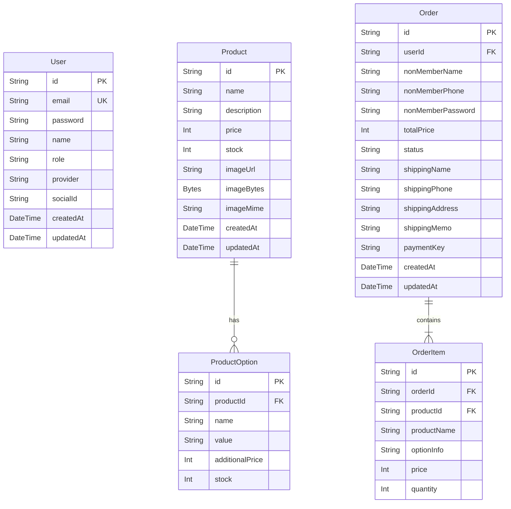

# 기술 명세서 (Technical Specification)

본 문서는 **비타민 쇼핑몰 (Vitamin Mall)** 프로젝트의 데이터 구조, 핵심 이미지 바이너리 처리 설계, 그리고 API 설계 규격을 상세히 정의한 기술 명세서입니다.

---

## 1. 데이터베이스 스키마 명세 (Prisma Schema)

데이터베이스 설계는 `Prisma ORM`을 바탕으로 작성되었으며, PostgreSQL 데이터베이스 상에 다음과 같은 물리 모델로 매핑됩니다.



### 1.1 Product 모델 구조
특히 이미지 처리를 위해 `imageBytes` 및 `imageMime` 컬럼이 설계되었습니다.
- **`imageBytes` (Bytes/bytea)**: 이미지의 원시 바이너리 스트림이 저장됩니다. 
- **`imageMime` (String/text)**: 이미지의 Content-Type 포맷(예: `image/png`, `image/jpeg`)을 저장하여 브라우저에 알맞은 응답 헤더를 지원합니다.
- **`imageUrl` (String/text)**: 프론트엔드가 이미지를 로드할 동적 API 주소인 `/api/products/image/${productId}`가 저장됩니다.

---

## 2. 이미지 바이너리 처리 아키텍처

로컬 파일 디스크나 유료 클라우드 스토리지를 배제하고 데이터베이스 내부 영구 영역에 파일 정보를 보관하는 파이프라인 설계입니다.

### 2.1 파일 업로드 시점의 흐름 (Base64 인코딩)
1. 어드민 페이지 상품 추가 폼에서 이미지를 올리면 [Upload API](file:///D:/fork/Shoping_Mall/src/app/api/admin/upload/route.ts)가 파일 바이너리를 받아 로컬 디스크가 아닌 **Base64 Data URL**로 문자열화하여 응답합니다.
   ```typescript
   const bytes = await file.arrayBuffer();
   const buffer = Buffer.from(bytes);
   const base64String = buffer.toString('base64');
   const dataUrl = `data:${file.type || 'image/png'};base64,${base64String}`;
   return NextResponse.json({ url: dataUrl });
   ```
2. 프론트엔드는 임시 디스크가 없으므로 해당 Base64 URL을 상품 저장 전까지 브라우저 메모리에 들고 있으며, 최종 상품 등록 요청 시 이 Base64 데이터 문자열을 백엔드로 보냅니다.

### 2.2 상품 등록/수정 시점의 흐름 (바이너리 디코딩 및 DB 쓰기)
1. [PrismaProductRepository](file:///D:/fork/Shoping_Mall/src/infrastructure/database/PrismaProductRepository.ts)에서 Base64 Data URL 문자열을 해독하여 원시 버퍼(Buffer)와 MIME 타입을 분리해 냅니다.
   ```typescript
   function parseBase64Image(dataUrl: string) {
       const matches = dataUrl.match(/^data:([A-Za-z-+\/]+);base64,(.+)$/);
       if (!matches || matches.length !== 3) return null;
       return {
           mimeType: matches[1],
           buffer: Buffer.from(matches[2], 'base64')
       };
   }
   ```
2. 생성된 상품 고유 ID(UUID)를 기준으로 `imageBytes`에는 디코딩된 Buffer 객체를, `imageMime`에는 MIME 형식을 채워넣고 `imageUrl`에는 서빙 전용 주소(`/api/products/image/${productId}`)를 기재해 DB 레코드를 삽입합니다.

### 2.3 이미지 조회/서빙 시점의 흐름 (동적 API 및 브라우저 캐싱)
1. 웹 서비스 사용자가 상품을 조회하여 이미지 URL인 `/api/products/image/[id]` 에 접근하면, [Image Serving API](file:///D:/fork/Shoping_Mall/src/app/api/products/image/%5Bid%5D/route.ts)가 동작합니다.
2. DB에서 bytea 필드를 읽어 응답 바디로 던지며, **브라우저 롱텀 캐시**를 설정하여 매 화면 전환 시 데이터베이스에 쿼리 요청이 중복해서 인입되지 않도록 부하를 차단합니다.
   ```typescript
   return new NextResponse(buffer, {
       headers: {
           'Content-Type': product.imageMime || 'image/png',
           'Cache-Control': 'public, max-age=31536000, immutable',
       }
   });
   ```

---

## 3. 핵심 API 엔드포인트 명세

### 3.1 이미지 업로드 API
- **엔드포인트**: `POST /api/admin/upload`
- **Request Body**: `multipart/form-data` (key: `file`)
- **Response**:
  ```json
  {
    "url": "data:image/png;base64,iVBORw0KGgoAAA..."
  }
  ```

### 3.2 이미지 동적 서빙 API
- **엔드포인트**: `GET /api/products/image/[id]`
- **Response**: Binary Image Buffer
- **Headers**:
  - `Content-Type`: `image/png` or `image/jpeg` 등
  - `Cache-Control`: `public, max-age=31536000, immutable`

### 3.3 상품 관리 API
- **상품 조회**: `GET /api/admin/products`
- **상품 등록**: `POST /api/admin/products`
  - Request Body:
    ```json
    {
      "name": "멀티비타민 골드",
      "description": "종합 비타민 영양제",
      "price": 32000,
      "stock": 100,
      "imageUrl": "data:image/png;base64,...",
      "options": [
        { "name": "용량", "value": "120정", "additionalPrice": 0, "stock": 50 }
      ]
    }
    ```
- **상품 수정**: `PUT /api/admin/products/[id]`
- **상품 삭제**: `DELETE /api/admin/products/[id]`
